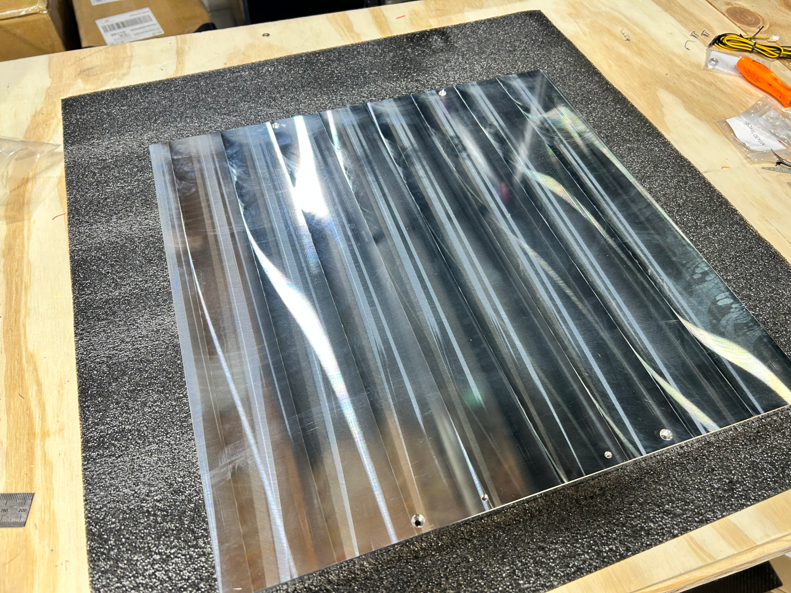
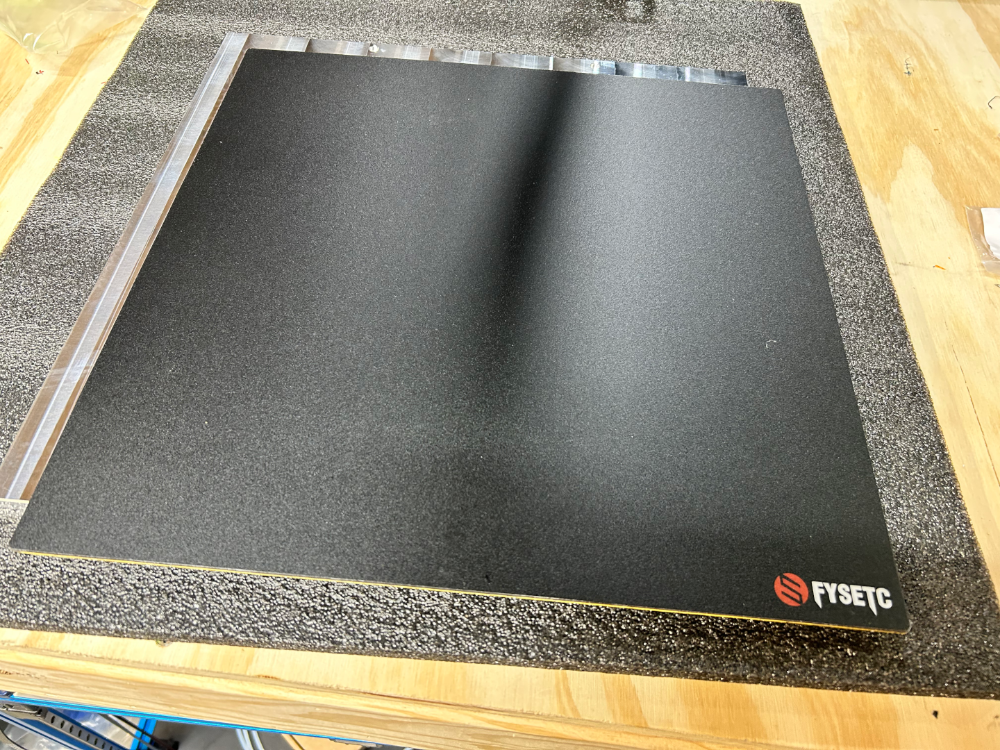
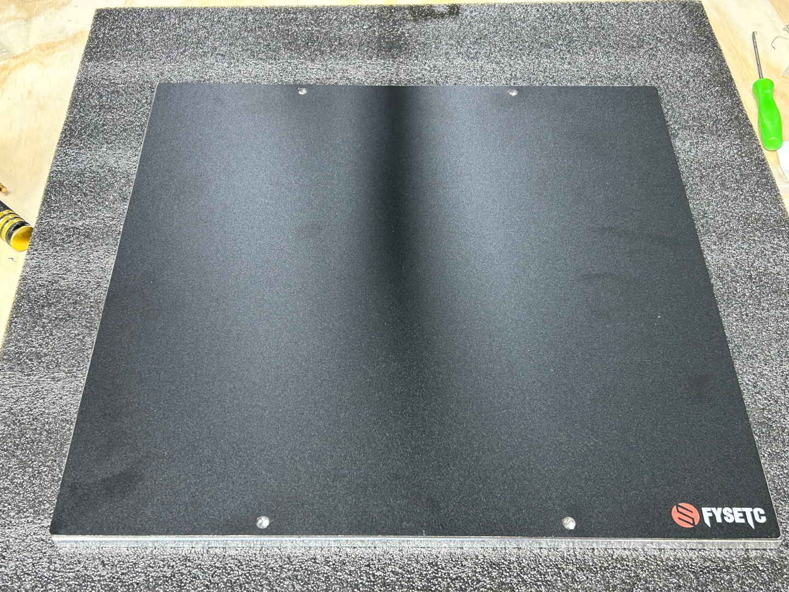
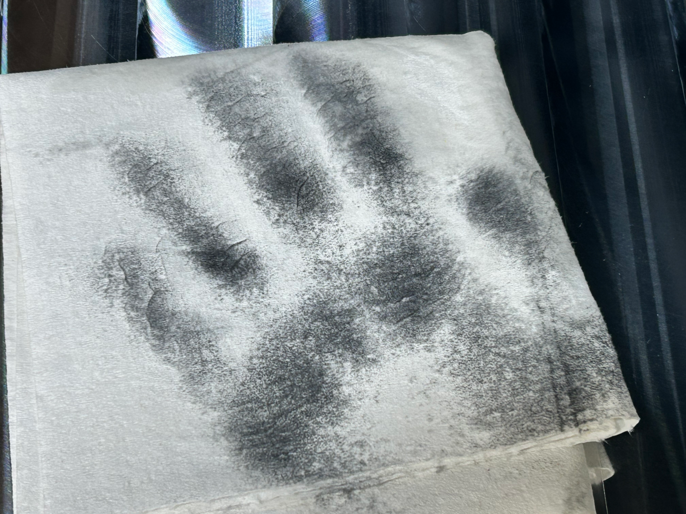
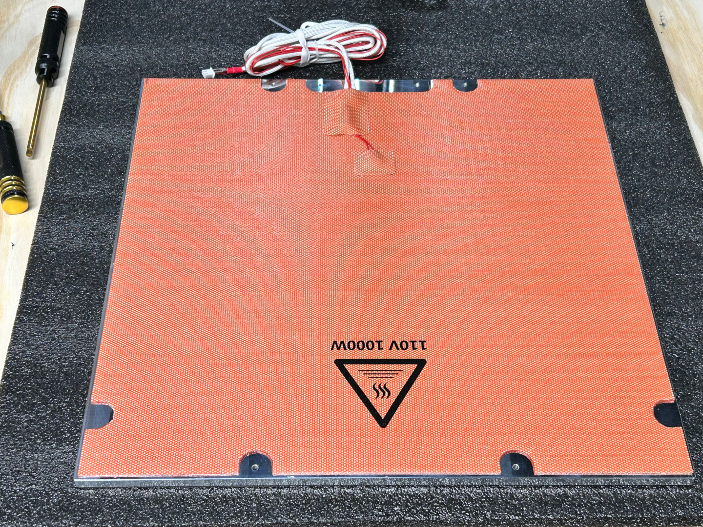
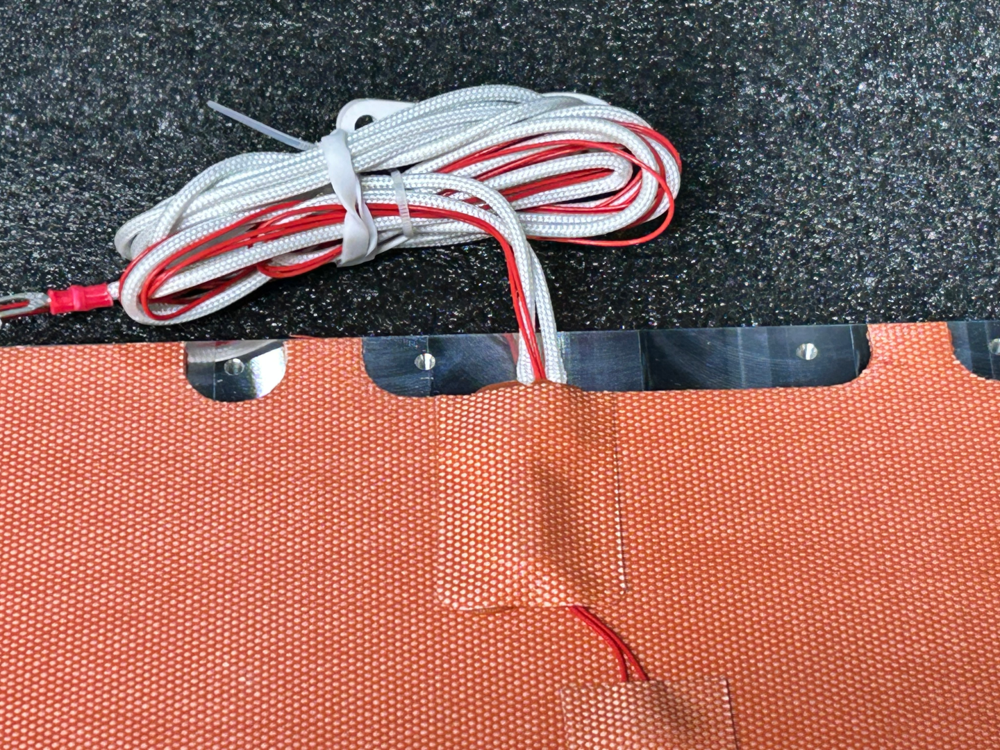

# Fysetc Voron 2.4 R2 Pro

When I built my first Voron, I was told that I should buy a LDO kit.  I do not recall if I was given specific reasons, but I do recall hearing things like, it was one of the most complete kits out there, you didn't have to terminate any cables, etc.

So I purchased and built my Voron.  Then months later, other people were asking me about building a Voron.  Just like those before me, I recommended the LDO kit.  It was then shown to me the Fysetc kit.  This kit seemed just as complete as the LDO, and included some upgraded items like TAP that I have since added on mine.

My response was simple.  I do not have any personal experience with that kit, but there must be a reason that everyone recommended to me the LDO kit.  We've all heard the old saying, "You get what you pay for".  But does it really have to be that expensive?

Well now that I have built LDO kits for V2.4, Trident and Switchwire, and have added some upgrades, I figured perhaps I need to personally look into this Fysetc kit to see is this something for a first time Voron builder to get them started into the wonderful world of Voron without the high entry price tag of a LDO kit?  Is this kit "good enough"?  Well with it being about 2/3 the cost of the LDO, and Fysetc having a sale, I purchased one to find out if this is beginner friendly enough for most.

I hope to use this as kind of a running note board for what I find along the way.

# The package

So when the kit arrived (and rather quickly I might add), it was in two boxes.  It appears that one contains the panels, heat bed, and build plate items.  The other is the only one I have opened so far.

So I don't do "unboxings", and normally don't take pictures of how an item is packaged, but I have to say I was impressed in how this was packaged.

I also greatly appreciated how the fasteners were nicely organized in a small parts box.  The LDO kits have everything separated into zip lock style bags with great labels.  But the further I got along in building my LDO kit, I had difficulty finding where that one bag of screws went.  I'm hoping this will make things easier for the Fysetc kit.  So score one for Fysetc over LDO in my book here.

One last thing from opening the box before moving on.  The X-gantry is an upgraded lightweight CNC item.  While I can't honestly speak to the strength/quality, the part looks very nice.

So, when I built my LDO kits, I worked from the standard Voron manual, printed the standard Voron parts from their official repo, and had to reference back and forth to the LDO information on some extra or different parts to print or processes.  At least that was the case for the Trident and V2.4.  The Voron Switchwire manual, actually calls out the differences for the LDO kit in the manual, so that was a bit nicer.

Fysetc has their own repo with the parts to print, manual, etc.  At first glance, the manual looks to be the standard Voron one, however the STLs to print are specific to this kit.  Where a Fysetc specific printed part exists, that file is in the repo in place of the original Voron part.  This made it easier (from my initial look) to make sure I print all the required parts, and no parts that I did not need.  This to me is another advantage for the Fysetc kit.  Granted it is still very early in the build of this printer, but so far things are looking pretty good.

For this build, I decided to use Ambrosia ASA filament from West3D.  [Galactic Midnight Meteorite](https://west3d.com/products/ambrosia-asa-galactic-filament-of-the-gods-glitter-sparkle-1kg-bambu-ams-friendly-cardboard-spools-premium-3d-printing-filament-house-asa?variant=44425288253652) for the primary color and [Galactic Grape](https://west3d.com/products/ambrosia-asa-galactic-filament-of-the-gods-glitter-sparkle-1kg-bambu-ams-friendly-cardboard-spools-premium-3d-printing-filament-house-asa?variant=44020725317844) for the accents.

In initial parts printing the part [FYSETC-VORON-2.4-R2-Pro/STLs/Cleaning brush/Voron R2&2.4 Cleaning brush.STL](https://github.com/FYSETC/FYSETC-VORON-2.4-R2-Pro/blob/main/STLs/Cleaning%20brush/Voron%20R2%262.4%20Cleaning%20brush.STL), the part is not properly orientated, and will need rotated to print properly.  I initially didn't catch that the part wasn't properly orientated, as I was accustomed to Voron parts being properly laid out.  

I was not able to find any additional build information for the Fysetc kit even though there are a few changes from the stock Voron 2.4 build.  So I am following the Voron build manual, and will note when and if I run into any issues.

## Frame
I found no issues with assembly of the frame.  The extrusion quality seems just fine, and I think I even read somewhere that Fysetc uses Misumi extrusions.

While I do not see it mentioned in the manual, I do recommend using some form of thread locker (non permanent) for frame assembly.

After the frame is assembled, you move on to installing linear rails for the Z axis.  It is mentioned in the manual, but I will stress here as well, the rails come with shipping oil on them.  Clean them with IPA or similar and grease the rails.  The Voron manual has a link to a video that covers the process of lubricating the rails, so I won't go into further detail here.

You will know that you have enough grease in the rail because there will be a slight drag when sliding the carriage, and it will feel the same the entire length of the rail.

When atttaching the rails to the extrusions, the diagrams show installing a bolt in every other hole rather than every one.  On a 350mm kit this will end up with one of the end holes not having a bolt in it.  So I start from both ends skipping one hole, then the two holes in the center will both have bolts in them.  This might be a bit overkill, but I prefer this to leaving a gap of 2 holes somewhere or an end hole.

The manual does show the rail installation guide.  You should have printed 2 each of the two different sizes.  Y and Z rails are the same size, and X is slightly wider.  Use these printed parts to ensure that the rail is centered on the extrusion as you tighten the rail to the extrusion.

While this may or may not be typical, I did seem to have a bit of difficulty removing the protective cover from the acrylic deck panel.  Mine wanted to rip a lot.  Take your time, and it will all come off.

## Z-Drive
This is the first place that heat set inserts are required.  One thing the Voron manual does not seem to have is a summary of where heat sets need to go.  I have used some other manuals that do cover this in the beginning.  Since this is the first place that heat sets are installed, I will give a list of pages below of where heat set inserts are installed.

#### Heat Set Inserts

Working with the Voron2 2.4R2 Build Guide dated 2023-07-04, the following pages have heat set inserts to install:

31, 64, 84, 129, 156, 201, 211, 212, 213, 250.

The Stealth Burner has a separate manual, so when I get to that point, I will come back and cover where heat set inserts go in that as well.

### Belt Drive Assembly
Page 32 starts setting up the bed drive assembly.  It is mentioned here to ensure you use thread locker on the pulley's set screws.  The LDO kits come with set screws with thread locker already on them, but the Fysetc does not.  It is up to you to apply thread locker.  As the manual says, this is the root of all issues.

Pulleys and bearings are in zipper close bags, however they are not labeled, so you may have to do some measuring to make sure you are using the correct items.

#### Z Idlers
While this isn't specifically an issue with the Fysetc kit, I'm not the biggest fan of the stock Z Idlers.  That is going on the list as one of the first things I will upgrade to the [Clee BZI](https://github.com/clee/VoronBFI) setup.  I will likely change out to the BFI as well like I did on my LDO V2.4 and Trident.

# Heated Bed
At first glance this is an area that is a massive with for the LDO kit over Fysetc.  With the LDO kit the heater and magnetic bed surface come pre-attached.  Attaching these items isn't the worst thing, but just nice thing to have already done for me.  However, the LDO bed heater is 750 watts while the Fysetc kit is 1000 watts.  This should help to get the bed up to temperatures faster.

Upon unwrapping the bed, I noticed that the machine marks are very noticeable and I can even feel them when I run my fingers across it.

Hopefully this will not transition through the magnetic sheet into the overall flatness of the bed surface.  Speaking of the magnetic bed surface, it looks WAY too much like a PEI sheet itself, and I think there will be the potential for me forgetting to put a build plate on and trying to print directly on the magnet.

The magnetic sheet also does not have cutouts for the mounting bolts.  This would require installing the magnetic sheet AFTER the bed is bolted in place.  This isn't a problem per-say, but if you ever need to remove the bed for any reason, this would make that more difficult.  I *think* I am going to attempt to cut access holes in the magnetic sheet before installing it to the bed.

Well, here is the modified and installed magnet.  

To modify the magnet, I placed it face down on the workbench with the bed on top of it.  Then using a small scribe I marked the center of each hole.  Then using a [body reamer](https://www.avidrc.com/product/5/accessories/3606/Body-Reamer-014mm-AV10094-accessories.html) for RC cars, I opened the hole until it was big enough to fit the head of a M3 SHCS through it.  I then went to the other side of the magnet and used the reamer there as well to make sure there were no burrs to catch.

Before installing the magnet or the heater, make sure you completely clean both sides of the bed as it will still have residue from machining.

I went over each side of the bed 3-4 times with IPA and paper towels.  This is important if you want your magnet and especially the heater to stay firmly attached.

The heater appears to be universal between V2.4 and Trident, however the bed is V2.4 only.  Make sure you align the wires from the heater with the side that has the extra screw holes that are for mounting a ground wire and the thermal fuse.

The last item for the bed appears to be some insulation.  LDO kits do not come with this insulation, so that is nice to have here.  But some people like to install bed fans to use the wasted heat from the bottom of the bed heater and circulate that air to help warm the chamber.  I think I'm going to install the insulation as I want my bed  to warm up quickly as a bed this big can take a while to get warm.  I will not install this insulation until after the thermal fuse and ground wires are attached to the bed, as it covers those mounting points.  It also does not have cutouts for where the bed mounts, so I will likely use a similar procedure to how I modified the bed magnet.

